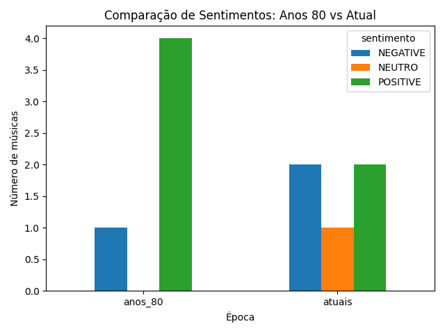

# 🎧 Análise de Sentimentos em Músicas

Projeto de Processamento de Linguagem Natural (PLN) que analisa sentimentos em músicas dos anos 80 e músicas atuais, utilizando reconhecimento de voz e modelos de inteligência artificial.

---

## 📌 Objetivo

Comparar os sentimentos predominantes em músicas de diferentes épocas, aplicando técnicas de NLP a dados áudio.

---

## ⚙️ Tecnologias Utilizadas

- Python
- Transformers (Hugging Face)
- SpeechRecognition
- PyDub
- Matplotlib
- Pandas

---

## 🧠 Metodologia

1. Recolha de ficheiros áudio (youtube conversão para mp3 co ymp3)  
2. Conversão de MP3 para WAV  
3. Transcrição áudio → texto  
4. Análise de sentimentos com IA  
5. Comparação entre épocas  
6. Visualização gráfica  

---

## 📊 Resultados

| Época   | Sentimento | Quantidade |
|--------|------------|------------|
| anos_80 | POSITIVE   | 4 |
| anos_80 | NEGATIVE   | 1 |
| atuais  | POSITIVE   | 2 |
| atuais  | NEGATIVE   | 2 |
| atuais  | NEUTRO     | 1 |

---

## 📈 Visualização

## 📈 Conclusão

As músicas dos anos 80 apresentam maior predominância de sentimentos positivos, enquanto as músicas atuais demonstram maior diversidade emocional.

---

## 📁 Estrutura do Projeto
data/
  anos_80/
  atuais/

src/
  main.py
  transcricao.py
  sentimento.py
  converter_audio.py

resultados/
  resultados.csv
  grafico.png

  ---

## 👤 Autor

Francisco Vaz
